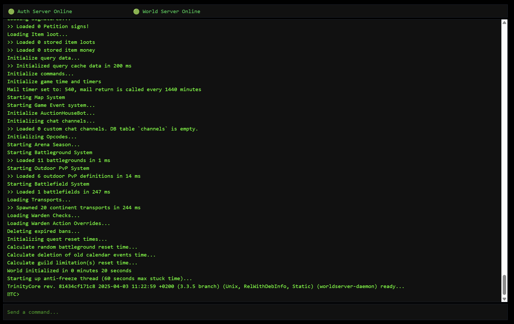

# TrinityCore Docker Environment
  

This project provides a Dockerized environment for experimenting, developing, and researching with the [TrinityCore](https://www.trinitycore.info/) World of Warcraft server emulator. It is intended for educational and non-commercial use only.

## 🚀 Features
- Easy setup with Docker Compose
- Automated database initialization and data extraction
- Minimal manual intervention required
- Web interface for interacting with the worldserver process

## ⚙️ Requirements
- [Docker](https://docs.docker.com/get-docker/)
- [Docker Compose](https://docs.docker.com/compose/install/)

## 📦 What's Included
- Multiple TrinityCore cores
- Automated setup scripts
- MySQL database server
- Web interface for server interaction

## 📁 Project Structure

```
trinitycore-docker/
├── client/     # Folder where you must place the WoW client files
└── docker-compose.yml
```

## 🛠️ Installation Steps
1. **Prepare directories and retreive the require files**

TrinityCore 3.3.5

```bash
mkdir trinitycore-docker
cd trinitycore-docker
curl -o docker-compose.yml https://raw.githubusercontent.com/valcriss/trinitycore-docker/refs/heads/main/docker-compose.335.yml
mkdir client
```

TrinityCore 4.4.2

```bash
mkdir trinitycore-docker
cd trinitycore-docker
curl -o docker-compose.yml https://raw.githubusercontent.com/valcriss/trinitycore-docker/refs/heads/main/docker-compose.442.yml
mkdir client
```

TrinityCore 11.2.0

```bash
mkdir trinitycore-docker
cd trinitycore-docker
curl -o docker-compose.yml https://raw.githubusercontent.com/valcriss/trinitycore-docker/refs/heads/main/docker-compose.1120.yml
mkdir client
```

1. **Place your WoW client files in the `client/` directory**

2. **Edit in the docker-compose.yml file the environment section according to your needs (public ip address, 127.0.0.1 if your computer hosts the game and the server).**

3. **Start the environment**
```bash
docker-compose up -d
```

The system will automatically:
- Download and initialize required databases
- Extract map and DBC data from your client files
- Start both `authserver` or `bnetserver` and `worldserver`

```
╔══════════════════════════════════════════════════════════════════════════════╗
║                         TrinityCore 335 Docker 1.0.0                         ║
╚══════════════════════════════════════════════════════════════════════════════╝

╔══════════════════════════════════════════════════════════════════════════════╗
║                         Checking database connection                         ║
╠══════════════════════════════════════════════════════════════════════════════╣
║ Connection to database successful.                                           ║
╚══════════════════════════════════════════════════════════════════════════════╝

╔══════════════════════════════════════════════════════════════════════════════╗
║                         Checking databases structure                         ║
╠══════════════════════════════════════════════════════════════════════════════╣
║ Databases are initialized.                                                   ║
╚══════════════════════════════════════════════════════════════════════════════╝

╔══════════════════════════════════════════════════════════════════════════════╗
║                           Checking databases data                            ║
╠══════════════════════════════════════════════════════════════════════════════╣
║ Databases are not empty.                                                     ║
╚══════════════════════════════════════════════════════════════════════════════╝

╔══════════════════════════════════════════════════════════════════════════════╗
║                   Updating auth server configuration files                   ║
╠══════════════════════════════════════════════════════════════════════════════╣
║ Writing auth server configuration successful.                                ║
╚══════════════════════════════════════════════════════════════════════════════╝

╔══════════════════════════════════════════════════════════════════════════════╗
║                  Updating world server configuration files                   ║
╠══════════════════════════════════════════════════════════════════════════════╣
║ Writing world server configuration successful.                               ║
╚══════════════════════════════════════════════════════════════════════════════╝

╔══════════════════════════════════════════════════════════════════════════════╗
║                        Updating application database                         ║
╠══════════════════════════════════════════════════════════════════════════════╣
║ Application database update successful.                                      ║
╚══════════════════════════════════════════════════════════════════════════════╝

╔══════════════════════════════════════════════════════════════════════════════╗
║                         Updating realm informations                          ║
╠══════════════════════════════════════════════════════════════════════════════╣
║ Realm informations update successful.                                        ║
╚══════════════════════════════════════════════════════════════════════════════╝

╔══════════════════════════════════════════════════════════════════════════════╗
║                           Checking client map data                           ║
╠══════════════════════════════════════════════════════════════════════════════╣
║ Client map data present.                                                     ║
╚══════════════════════════════════════════════════════════════════════════════╝

╔══════════════════════════════════════════════════════════════════════════════╗
║                         Application Startup Complete                         ║
╚══════════════════════════════════════════════════════════════════════════════╝

╔══════════════════════════════════════════════════════════════════════════════╗
║                Web interface listening on http://0.0.0.0:3000                ║
╚══════════════════════════════════════════════════════════════════════════════╝
```


## 🧪 Using the Server
After startup, you can access the web interface to control the server:

```http
http://<container-ip>:3000
```

Through the web interface, you can send commands to `worldserver`, such as creating game accounts.




> ⚠️ Don’t forget to edit your **realmlist.wtf** or **Config.wtf** file to point to the container’s IP address.

## 🔒 User Authentication

The web interface now includes a secure authentication mechanism to restrict access. Users must log in with a valid username and password to interact with the server.

### How It Works:
- **Login Page**: Upon accessing the web interface, users are prompted to log in if authentication is enabled.
- **Environment Configuration**: Set the `ACCESS_USERNAME` and `ACCESS_PASSWORD` environment variables in the `docker-compose.yml` file to define the credentials.
- **Session Management**: Once authenticated, the session remains active until the browser is closed.

> ⚠️ Ensure you configure strong credentials to secure your server.

## Environment Overrides For Trinity Config

You can override TrinityCore `.conf` properties at container startup with environment variables.

- Worldserver prefix: `TC_WORLD__`
- Auth/Bnet prefix: `TC_AUTH__`
- Key format: replace `.` with `__`

Examples:

```yaml
environment:
	- TC_WORLD__Rate__XP__Kill=3
	- TC_WORLD__PlayerLimit=200
	- TC_WORLD__Motd="Welcome to my realm"
	- TC_AUTH__Battlenet__PasswordChangeSecurity=0
```

How it works:
- `TC_WORLD__Rate__XP__Kill=3` becomes `Rate.XP.Kill = 3` in `worldserver.conf`
- `TC_AUTH__Battlenet__PasswordChangeSecurity=0` becomes `Battlenet.PasswordChangeSecurity = 0` in auth config
- If a key already exists, its value is replaced.
- If a key does not exist, it is appended at the end of the file.

## ❓ Notes
- A compatible WoW client is required, but **not provided**.
- All databases (`auth`, `characters`, `world`) are automatically created and populated at first run.
- Account creation is handled via the web UI or TrinityCore commands.

⚠️ This project is not affiliated with or endorsed by Blizzard Entertainment or TrinityCore. Use of the trinitycore emulator is intended strictly for educational and non-commercial purposes.

## 💡 Troubleshooting & Tips
- Ensure the WoW client version is **exactly 3.3.5a (12340)** for extraction to succeed.
- If the client files are not correctly placed in `client/`, extraction and setup will fail.
- Use `docker logs <container-name>` for debugging.

## 🤝 Contributing
Contributions are welcome! Feel free to open issues or submit pull requests.

## 📜 License
This project is open-source under the MIT License.

